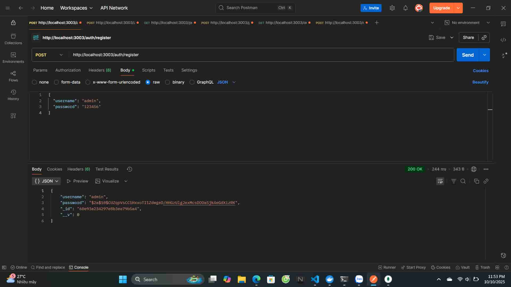
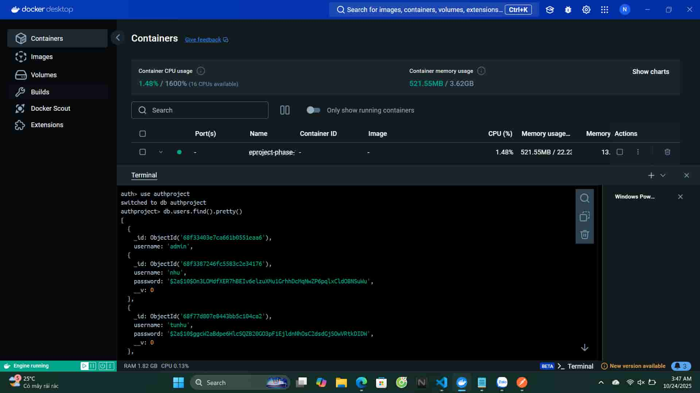

- Đầu tiên sẽ thêm các dữ liệu vào các file .env
- Sau đó tải Docker và thêm RabbitMQ vào Docker bằng câu lệch "docker run -d --hostname rabbitmq --name rabbitmq -p 5672:5672 -p 15672:15672 rabbitmq:3-management"
- Vào địa chỉ http://localhost:15672 để nhập Username: guest, Password: guest
- Thêm file "Dockerfile" vào api-gateway, auth, product, order
- Tạo thêm file "docker-compose.yml" trong thư mục gốc dự án
- Chạy Docker Compose với câu lệch "docker-compose up --build"

#### 1. Đối với Auth
- Tạo tài khoản 

- Đăng nhập

- Truy cập dashboard

#### 2. Đối với Product

- Thêm sản phẩm 

- Xem danh sách sản phẩm 

- Mua sản phẩm

- Xem lại thông tin dựa vào id sản phẩm

- Xem lại đơn hàng dựa vào id đơn hàng

#### 3.Kiểm tra bên Docker sau khi thực hiện test trên Postman

- Auth

- Product

- Order

#### 4. Github Action và CI/CD

- Github Action

- CI/CD bên Docker Hub

